# Project Data Flow

> Render in VS Code with **Markdown Preview Mermaid Support** (`bierner.markdown-mermaid`)
> or paste into **https://mermaid.live**

```mermaid
flowchart TD

    %% ── RAW SOURCES ─────────────────────────────────────────────────────────

    SAPF_DB[("SAPFLUXNET database<br/>data/raw/0.1.5/.../csv/sapwood/<br/>*_sapf_data.csv<br/>*_env_data.csv<br/>*_site_md.csv<br/>already in consistent format")]

    SI_RAW[("Sapflow-internal<br/>raw field + ICOS measurements<br/>non-standard format")]

    GEE_API(["Google Earth Engine API<br/>MODIS MCD12Q1  Meta canopy height<br/>ASTER GDEM  ERA5-Land site extraction"])

    LOCAL_PRE(["Pre-downloaded local files<br/>data/raw/grided/globmap_lai/<br/>  GlobMapLAIV3.A*.Global.LAI.tif<br/>data/raw/grided/stand_age/<br/>  2026*_BGIForestAgeMPIBGC1.0.0.nc"])

    REST_API(["SoilGrids REST API<br/>https://rest.isric.org/soilgrids/v2.0/<br/>properties/query"])

    ERA5_GRID(["Google Earth Engine<br/>ERA5-Land ImageCollection<br/>for global prediction<br/>temp cache: D:/Temp/era5land_extracted/"])

    %% ── STAGE 1a : SAPFLUXNET  (no reorganisation needed) ───────────────────

    subgraph SAPF_STREAM ["SAPFLUXNET stream"]
        SAPF_NOTE["Already SAPFLUXNET-format<br/>No reorganisation needed"]
    end

    SAPF_DB --> SAPF_NOTE

    %% ── STAGE 1b : Sapflow-internal preparation ─────────────────────────────

    subgraph SI_STREAM ["Sapflow-internal stream  [Sapflow-internal/]"]
        SI_REORG["sap_reorganizer.py<br/>Reorganise raw files<br/>to SAPFLUXNET structure"]
        SI_UNIT["sap_unit_converter.py<br/>Convert sap velocity units"]
        SI_P2S["plant_to_sapwood_converter.py<br/>Plant scale to sapwood scale"]
        SI_ICOS["icos_env_extractor.py<br/>icos_fluxnet_extractor.py<br/>Extract ICOS env data<br/>for Sapflow-internal sites only"]
        SI_REORG --> SI_UNIT --> SI_P2S
    end

    SI_RAW --> SI_REORG
    SI_RAW --> SI_ICOS

    SI_FMT[/"Sapflow-internal formatted<br/>Sapflow_SAPFLUXNET_format_unitcon/<br/>sapwood/  *_sapf_data.csv<br/>env_icos/  *_env_data.csv"/]

    SI_P2S  --> SI_FMT
    SI_ICOS --> SI_FMT

    %% ── STAGE 2 : Site-level feature extraction  (parallel) ─────────────────

    subgraph EXTRACT ["2 - Site-level Feature Extraction  [src/Extractors/]"]
        EXT_INFO["extract_siteinfo.py<br/>Pull site metadata<br/>from SAPFLUXNET plant files"]
        EXT_ERA5["extract_climatedata_gee.py<br/>Hourly ERA5-Land per site<br/>via GEE"]
        EXT_LAI_GLOB["extract_globmap_lai.py<br/>GlobMap LAI per site<br/>hourly  FROM LOCAL rasters<br/>used by merge pipeline"]
        EXT_LAI_GEE["extract_lai.py<br/>MODIS+AVHRR LAI via GEE<br/>outputs to src/Extractors/<br/>NOT used by merge pipeline"]
        EXT_PFT["extract_pft.py<br/>MODIS MCD12Q1 LC_Type1<br/>IGBP class per site per year"]
        EXT_CAN["extract_canopyheight.py<br/>Meta canopy height (GEE)<br/>+ ASTER GDEM elevation+terrain"]
        EXT_WC["spatial_features_extractor.py<br/>Auto-downloads WorldClim+Koppen<br/>Input: terrain_attributes CSV<br/>not site_info directly"]
        EXT_SOIL["extract_soilgrid.py<br/>SoilGrids soil properties<br/>via REST API"]
        EXT_AGE["extract_stand_age.py<br/>Forest stand age<br/>from local NetCDF"]
    end

    SAPF_DB   -->|site_info.csv| EXT_INFO
    GEE_API   --> EXT_ERA5
    GEE_API   --> EXT_PFT
    GEE_API   --> EXT_CAN
    GEE_API   --> EXT_LAI_GEE
    LOCAL_PRE -->|"GlobMap LAI tifs"| EXT_LAI_GLOB
    LOCAL_PRE -->|"Stand Age NetCDF"| EXT_AGE
    REST_API  --> EXT_SOIL
    EXT_INFO  --> EXT_ERA5
    EXT_INFO  --> EXT_LAI_GLOB
    EXT_INFO  --> EXT_PFT
    EXT_INFO  --> EXT_CAN
    EXT_INFO  --> EXT_SOIL
    EXT_INFO  --> EXT_AGE

    ERA5_CSV[/"data/raw/extracted_data/era5land_site_data/<br/>sapwood/era5_extracted_data.csv<br/>Hourly ERA5 vars per site"/]
    LAI_CSV[/"data/raw/extracted_data/globmap_lai_site_data/<br/>sapwood/extracted_globmap_lai_hourly.csv"/]
    LAI_GEE_OUT[/"src/Extractors/enhanced_lai_high_freq_hourly.csv<br/>not consumed by merge pipeline"/]
    PFT_CSV[/"data/raw/extracted_data/landcover_data/<br/>sapwood/landcover_output.csv"/]
    TERRAIN_CSV[/"data/raw/extracted_data/terrain_site_data/<br/>sapwood/site_info_with_terrain_data.csv<br/>canopy_height_m  elevation_m  slope_deg  aspect"/]
    ENV_CSV[/"data/raw/extracted_data/env_site_data/<br/>sapwood/site_info_with_env_data.csv<br/>WorldClim bioclim  Koppen zone"/]
    SOIL_CSV[/"data/raw/extracted_data/terrain_site_data/<br/>sapwood/soilgrids_data.csv<br/>stand_age_data.csv"/]

    EXT_ERA5     --> ERA5_CSV
    EXT_LAI_GLOB --> LAI_CSV
    EXT_LAI_GEE  --> LAI_GEE_OUT
    EXT_PFT      --> PFT_CSV
    EXT_CAN      --> TERRAIN_CSV
    TERRAIN_CSV  --> EXT_WC
    EXT_WC       --> ENV_CSV
    EXT_SOIL     --> SOIL_CSV
    EXT_AGE      --> SOIL_CSV

    %% ── STAGE 3 : Quality Control ───────────────────────────────────────────

    subgraph QC ["3 - Quality Control  [src/Analyzers/]"]
        SAP_ANA["sap_analyzer.py  SapFlowAnalyzer<br/>Timezone adjust<br/>Flag-based filtering<br/>Outlier removal  STD window<br/>Variability filter  CV threshold<br/>Baseline drift correction"]
        ENV_ANA["env_analyzer.py  EnvironmentalAnalyzer<br/>Timezone adjust<br/>Outlier removal<br/>Standardisation"]
        MANUAL["mannual_removal_processor.py<br/>removal_log.csv<br/>Manual flags applied<br/>during _load_sapflow_data"]
    end

    SAPF_NOTE --> SAP_ANA
    SAPF_NOTE --> ENV_ANA
    SI_FMT    -->|"sapwood/*_sapf_data.csv"| SAP_ANA
    SI_FMT    -->|"env_icos/*_env_data.csv"| ENV_ANA
    MANUAL    --> SAP_ANA

    SAP_QC[/"outputs/processed_data/sapwood/sap/outliers_removed/<br/>*_sapf_data_outliers_removed.csv  per site"/]
    ENV_QC[/"outputs/processed_data/sapwood/env/outliers_removed/<br/>*_env_data_outliers_removed.csv  per site"/]

    SAP_ANA --> SAP_QC
    ENV_ANA --> ENV_QC

    %% ── STAGE 3b : Gap Filling  (separate utility, not in merge pipeline) ───

    subgraph GAP ["3b - Gap Filling utility  [notebooks/]"]
        GAP_SAP["sap_gap_filling.py<br/>Linear interpolation<br/>max gap = 1 step"]
        GAP_ENV["env_gap_filling.py<br/>Linear interpolation<br/>max gap = 1 step"]
    end

    SAP_ANA -->|"sap/filtered/"| GAP_SAP
    ENV_ANA -->|"env/filtered/"| GAP_ENV

    SAP_GF[/"outputs/processed_data/sap/gap_filled_size1_after_filter/<br/>*_gap_filled.csv<br/>not consumed by merge pipeline"/]
    ENV_GF[/"outputs/processed_data/env/gap_filled_size1_after_filter/<br/>*_gap_filled.csv<br/>not consumed by merge pipeline"/]

    GAP_SAP --> SAP_GF
    GAP_ENV --> ENV_GF

    %% ── STAGE 4 : Data Merging ───────────────────────────────────────────────

    subgraph MERGE ["4 - Data Merging  [notebooks/merge_gap_filled_hourly_orginal.py]"]
        MERGE_SCR["merge_sap_env_data_site<br/>Join sap + env per site<br/>Resample to hourly<br/>Add ERA5 vars  LAI  PFT<br/>Add WorldClim  terrain  soil<br/>Add stand age  biome label<br/>Daytime filter option"]
    end

    SAP_QC   -->|"sap_outliers_removed_dir"| MERGE_SCR
    ENV_QC   -->|"env_outliers_removed_dir"| MERGE_SCR
    ERA5_CSV -->|"era5_discrete_data_path<br/>direct join on site+timestamp"| MERGE_SCR
    LAI_CSV  -->|"globmap_lai_data_path<br/>direct join"| MERGE_SCR
    PFT_CSV  -->|"pft_data_path<br/>direct join"| MERGE_SCR
    ENV_CSV  -->|"env_extracted_data_path<br/>WorldClim+Koppen+terrain"| MERGE_SCR
    SOIL_CSV -->|"soilgrids + stand_age<br/>static site features"| MERGE_SCR

    MERGED[/"outputs/processed_data/sapwood/merged/<br/>merged_data.csv  all sites hourly<br/>site_biome_mapping.csv<br/>hourly/  per-site CSVs<br/>daily/   per-site CSVs"/]

    MERGE_SCR --> MERGED

    %% ── STAGE 5 : Model Training ─────────────────────────────────────────────

    subgraph TRAIN ["5 - Model Training  [src/hyperparameter_optimization/]"]
        TP["timeseries_processor1.py<br/>TimeSeriesSegmenter<br/>WindowGenerator"]
        BCV["blockcv.py<br/>BlockCV  spatial blocks<br/>autocorrelation sizing"]
        ANN_SP["ann_spatial.py<br/>ANN  GroupKFold spatial CV"]
        ANN_TMP["ann_temporal_seg.py<br/>ANN  leave-segment-out temporal CV"]
        ANN_BLK["ann_blockcv.py<br/>ANN  spatial block CV"]
        ML_SP["ML_spatial_stratified.py<br/>XGBoost  RF  SVM  spatial CV"]
        DL_SP["DL_spatial_stratified.py<br/>CNN-LSTM  LSTM  Transformer  spatial CV"]
        RF_SP["rf_spatial.py<br/>Random Forest  spatial CV"]
        HT["hyper_tuner.py<br/>get_performance_by_forest.py"]
    end

    MERGED --> ANN_SP
    MERGED --> ANN_TMP
    MERGED --> ANN_BLK
    MERGED --> ML_SP
    MERGED --> DL_SP
    MERGED --> RF_SP
    TP  --> ANN_SP
    TP  --> ANN_TMP
    TP  --> DL_SP
    TP  --> ML_SP
    BCV --> ANN_BLK
    HT  --> ANN_SP
    HT  --> ML_SP
    HT  --> DL_SP

    MODELS[/"outputs/models/<br/>ann_regression/  xgb_regression/<br/>rf_regression/  cnn_lstm_regression/<br/>*.h5  *.joblib  *.json  + config JSON"/]
    SCALERS[/"outputs/scalers/<br/>feature_scaler.pkl  label_scaler.pkl<br/>also stored per-model inside<br/>outputs/models/{type}_regression/<br/>FINAL_scaler_{run_id}_feature.pkl"/]

    ANN_SP  --> MODELS
    ANN_TMP --> MODELS
    ANN_BLK --> MODELS
    ML_SP   --> MODELS
    DL_SP   --> MODELS
    RF_SP   --> MODELS
    ANN_SP  --> SCALERS
    ML_SP   --> SCALERS

    %% ── STAGE 5b : SHAP Analysis ────────────────────────────────────────────

    subgraph SHAP_STAGE ["5b - SHAP Feature Importance  [src/hyperparameter_optimization/]"]
        SHAP_SCR["test_hyperparameter_tuning_ML_spatial_stratified.py<br/>shap.TreeExplainer on final XGBoost/RF model<br/>Summary  bar  waterfall  dependency plots<br/>Seasonal drivers  diurnal heatmap  by-PFT plots<br/>Aggregates windowed + static features<br/>Groups PFT one-hot columns"]
    end

    MODELS  -->|"final_model (XGBoost/RF)"| SHAP_SCR
    MERGED  -->|"X_test split"| SHAP_SCR

    SHAP_NPZ[/"outputs/plots/hyperparameter_optimization/{MODEL_TYPE}/{run_id}/<br/>shap_values_{run_id}.npz<br/>  shap_values  shap_values_pft_aggregated  shap_values_raw<br/>shap_feature_importance.csv<br/>shap_statistics_by_pft.csv<br/>shap_importance_pivot_by_pft.csv"/]
    SHAP_FIGS[/"outputs/plots/hyperparameter_optimization/{MODEL_TYPE}/{run_id}/<br/>Global: shap_summary_beeswarm.png  shap_summary_beeswarm_grouped.png<br/>         shap_global_importance_bar.png  shap_global_importance_bar_grouped.png<br/>         shap_partial_dependence.png  shap_partial_dependence_grouped.png<br/>         shap_spatial_maps.png  shap_static_vs_dynamic.png<br/>Local:  shap_waterfall_High_Flow.png  shap_waterfall_Low_Flow.png<br/>Time:   shap_time_step_comparison.png  (windowed only)<br/>Temp:   fig7_seasonal_drivers_by_hemisphere.png<br/>         fig_diurnal_drivers.png  fig_diurnal_drivers_heatmap.png<br/>         fig_diurnal_drivers_lines.png  fig8_dependence_interaction.png<br/>PFT:    shap_by_pft_boxplot.png  shap_by_pft_violin.png<br/>         shap_importance_heatmap_by_pft.png  shap_top_features_per_pft.png<br/>         shap_pft_contribution_comparison.png  shap_pft_radar_chart.png<br/>         shap_summary_{pft}.png  (one per PFT type)"/]

    SHAP_SCR --> SHAP_NPZ
    SHAP_SCR --> SHAP_FIGS

    %% ── STAGE 6 : Global Prediction ─────────────────────────────────────────

    subgraph PREDICT ["6 - Global Prediction  [src/make_prediction/]"]
        ERA5_PROC["process_era5land_gee_opt_fix.py  ERA5LandGEEProcessor<br/>Fetch ERA5-Land from GEE per grid cell<br/>Derive VPD  PET  ppfd  wind speed<br/>Add LAI  PFT  canopy via GEE<br/>Add WorldClim bioclim + biome"]
        PRED_SCR["predict_sap_velocity_sequantial.py<br/>Apply trained model per grid cell<br/>windowed inference  ModelConfig<br/>config.py for paths and params"]
    end

    ERA5_GRID  -->|"ERA5-Land ImageCollection<br/>fetched per grid cell"| ERA5_PROC
    GEE_API    -->|"LAI  PFT  canopy height"| ERA5_PROC
    MODELS     --> PRED_SCR
    SCALERS    --> PRED_SCR
    ERA5_PROC  --> PRED_SCR

    PRED_CSV[/"data/predictions/<br/>combined_predictions_improved.csv<br/>prediction_YYYY_MM_DD_predictions_improved.csv"/]

    PRED_SCR --> PRED_CSV

    %% ── STAGE 7 : Visualisation ──────────────────────────────────────────────

    subgraph VIS ["7 - Visualisation  [src/make_prediction/]"]
        VIS1["prediction_visualization.py<br/>CSV to GeoTIFF to PNG global map"]
        VIS2["prediction_visualization_midday.py<br/>Same with midday filter 10-14h"]
        VIS3["sap_velocity_by_climatezone_forest.py<br/>Bar charts by climate zone and forest type"]
    end

    PRED_CSV --> VIS1
    PRED_CSV --> VIS2
    PRED_CSV --> VIS3

    MAPS[/"outputs/maps/<br/>global_sap_velocity_*.tif<br/>global_sap_velocity_*.png"/]
    FIGS[/"outputs/figures/<br/>sap_velocity_by_climatezone_forest_*.png"/]

    VIS1 --> MAPS
    VIS2 --> MAPS
    VIS3 --> FIGS

    %% ── STAGE 8 : Analysis Notebooks ────────────────────────────────────────

    subgraph ANALYSIS ["8 - Exploratory Analysis  [notebooks/]"]
        AN1["VPD_mismatch_analysis.py<br/>Diagnose ERA5 vs measured VPD"]
        AN2["swin_compariosn.py<br/>Shortwave radiation comparison"]
        AN3["frequency_analysis.py<br/>timeseries_segmentation.py<br/>Signal analysis"]
        AN4["initial_exploration.py<br/>joint_sy.py<br/>Data summaries"]
    end

    MERGED --> AN1
    MERGED --> AN2
    MERGED --> AN3
    MERGED --> AN4

    %% ── STYLING ──────────────────────────────────────────────────────────────
    classDef datafile fill:#dbeafe,stroke:#3b82f6,color:#1e3a5f
    classDef srcnode  fill:#fef9c3,stroke:#ca8a04,color:#713f12
    classDef outfile  fill:#fce7f3,stroke:#db2777,color:#831843
    classDef orphan   fill:#f3f4f6,stroke:#9ca3af,color:#6b7280,stroke-dasharray:5 5

    class ERA5_CSV,LAI_CSV,PFT_CSV,TERRAIN_CSV,ENV_CSV,SOIL_CSV,SAP_QC,ENV_QC,MERGED,MODELS,SCALERS,PRED_CSV,SI_FMT,SHAP_NPZ datafile
    class MAPS,FIGS,SHAP_FIGS outfile
    class SAPF_DB,SI_RAW,GEE_API,LOCAL_PRE,REST_API,ERA5_GRID srcnode
    class SAP_GF,ENV_GF,LAI_GEE_OUT orphan
```

---

## Pipeline summary

| Stage               | Key scripts                                                              | Input                                                   | Output                                                       |
| ------------------- | ------------------------------------------------------------------------ | ------------------------------------------------------- | ------------------------------------------------------------ |
| 1a SAPFLUXNET       | —                                                                        | Raw SAPFLUXNET CSVs                                     | Already structured, pass through                             |
| 1b Sapflow-internal | `Sapflow-internal/*.py`                                                  | Raw field + ICOS data                                   | `Sapflow_SAPFLUXNET_format_unitcon/sapwood/ + env_icos/`     |
| 2 Extract           | `src/Extractors/*.py`                                                    | `site_info.csv` + GEE + rasters                         | `data/raw/extracted_data/*/`                                 |
| 3 QC                | `src/Analyzers/*.py`                                                     | `*_sapf_data.csv`, `*_env_data.csv`                     | `outputs/processed_data/sapwood/{sap,env}/outliers_removed/` |
| 3b Gap fill         | `notebooks/sap_gap_filling.py`, `env_gap_filling.py`                     | `sap/filtered/`, `env/filtered/`                        | `gap_filled_size1_after_filter/` (not used by merge)         |
| 4 Merge             | `notebooks/merge_gap_filled_hourly_orginal.py`                           | QC sap + env + ERA5 site + LAI + PFT + WorldClim + soil | `outputs/processed_data/sapwood/merged/merged_data.csv`      |
| 5 Train             | `src/hyperparameter_optimization/test_*.py`                              | `merged_data.csv`                                       | `outputs/models/` + `outputs/scalers/`                       |
| 6 Predict           | `process_era5land_gee_opt_fix.py` + `predict_sap_velocity_sequantial.py` | Gridded ERA5-Land + models                              | `data/predictions/*.csv`                                     |
| 7 Visualise         | `prediction_visualization*.py`                                           | Prediction CSVs                                         | `outputs/maps/*.tif` + `*.png`                               |
