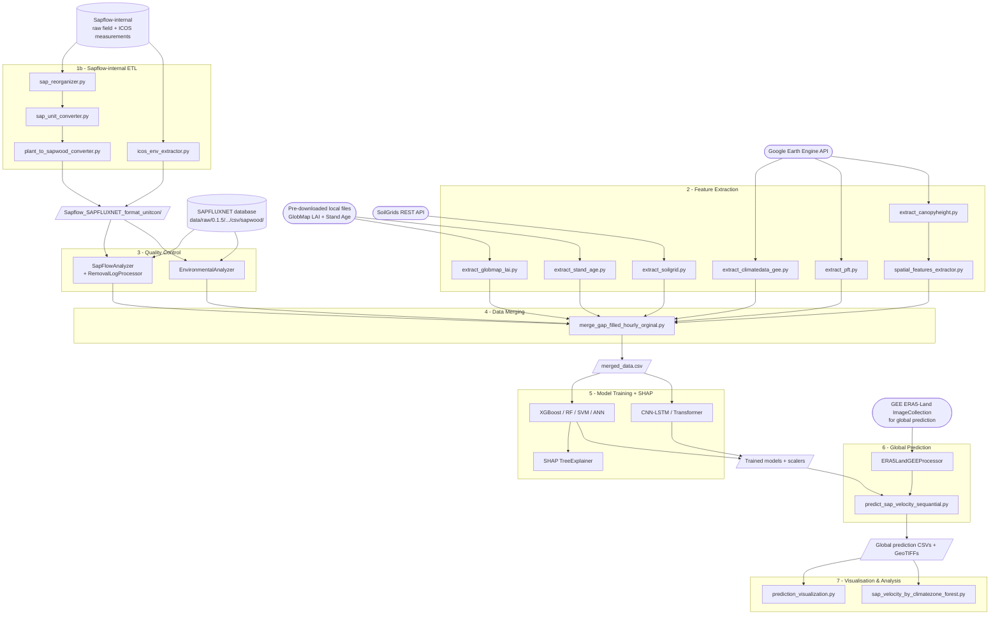

**Version:** 1.0
**Last updated:** 2026-03
**Author:** Yu Luo
**Supervisor:** Mana Gharun

**Affiliation:** Biosphere-Atmosphere Interaction Research Group, Institute of Landscape Ecology, University of Münster, Germany
**GEE Project:** `ee-yuluo-2/era5download-447713`

---

## Table of Contents

1. [Introduction](about:blank#1-introduction)
2. [Data Sources](about:blank#2-data-sources)
3. [Dataset Summary Statistics](about:blank#3-dataset-summary-statistics)
4. [Data Processing and Quality Control](about:blank#4-data-processing-and-quality-control)
5. [Non-Standard Data Sources (Sapflow-internal)](about:blank#5-non-standard-data-sources-sapflow-internal)
6. [Data Integration and Merging](about:blank#6-data-integration-and-merging)
7. [Feature Engineering](about:blank#7-feature-engineering)
8. [Model Architecture and Training](about:blank#8-model-architecture-and-training)
9. [Cross-Validation Strategies](about:blank#9-cross-validation-strategies)
10. [SHAP Interpretability Analysis](about:blank#10-shap-interpretability-analysis)
11. [Results and Evaluation](about:blank#11-results-and-evaluation)
12. [Global Prediction Pipeline](about:blank#12-global-prediction-pipeline)
13. [Post-Prediction Analysis](about:blank#13-post-prediction-analysis)
14. [Project Structure and Setup](about:blank#14-project-structure-and-setup)
15. [Limitations and Future Work](about:blank#15-limitations-and-future-work)
16. [References](about:blank#16-references)
17. [Data Flow Diagram](about:blank#17-data-flow-diagram)

---

## 1. Introduction

### 1.1 Scientific Motivation

Sap velocity — the rate at which water moves through the xylem of trees — is a direct indicator of whole-tree transpiration and a key variable linking forest carbon assimilation, water-cycle feedback, and ecosystem response to climate variability. While point-level sap flow instruments have generated rich in-situ datasets at individual forest sites, scaling these observations to continental or global extents remains a fundamental challenge in eco-hydrology and climate science.

Existing global land-surface models treat plant water use through parameterized functions of vapour-pressure deficit (VPD) and soil moisture, but they rarely capture the structural, taxonomic, and microclimatic diversity that shapes real-world sap velocity across forest types and biomes. Machine learning offers an empirical bridge: trained on the largest available compilation of sap flow observations and a suite of meteorological and structural covariates extracted from satellite and reanalysis products, a well-validated model can produce spatially continuous, daily or hourly sap velocity estimates anywhere on Earth where trees exist.

This project develops, validates, and applies such a model. The trained model generates the first globally coherent sap velocity dataset at **0.1° × 0.1°** resolution (matching ERA5-Land native resolution, ~11 km at equator), enabling downstream analyses of forest water use, transpiration trends, and biome-level responses to drought and warming.

### 1.2 Research Objectives

1. Produce a daily, global time-series map of tree water use (sap velocity)
2. Reveal spatial and temporal patterns of how environmental predictors and their interactions drive tree water use
3. Identify systematic variations of tree water use across forest types and biomes
4. Quantify global forest water demand to guide forest restoration strategies

### 1.3 Methodological Summary

In-situ sap velocity observations and auxiliary environmental data from 165 sites across 8 biomes and 33 countries are quality-controlled and merged with co-located hourly ERA5-Land meteorological forcing, GlobMap LAI time series, MODIS plant functional type (PFT), canopy height, terrain attributes, WorldClim bioclimatic variables, SoilGrids properties, and forest stand age. The merged dataset is used to train tree-ensemble and deep-learning regression models under stratified spatial cross-validation. The best-performing model is then applied globally using GEE-extracted ERA5-Land fields and satellite-derived structural features to produce gridded sap velocity maps. SHAP TreeExplainer analysis identifies how predicted sap flovw values are derived by dominant drivers at global, biome, seasonal, and diurnal timescales.

---

## 2. Data Sources

### 2.1 SAPFLUXNET Database

### 2.1 SAPFLUXNET Database

| Property                | Value                                                                                                                                                                                                                                                          |
| ----------------------- | -------------------------------------------------------------------------------------------------------------------------------------------------------------------------------------------------------------------------------------------------------------- |
| **What it contains**    | Standardized sap flow velocity and environmental measurements from peer-reviewed forest sites worldwide                                                                                                                                                        |
| **Variables**           | Sap flow velocity (cm h⁻¹ or equivalent), air temperature, vapour-pressure deficit, shortwave radiation, wind speed, precipitation, soil moisture (site-dependent)                                                                                             |
| **Spatial coverage**    | Global; 165 sites in 33 countries                                                                                                                                                                                                                              |
| **Temporal coverage**   | 1995–2018 (site-dependent)                                                                                                                                                                                                                                     |
| **Temporal resolution** | Sub-hourly (30-min to 2-h depending on site), resampled to 1-h                                                                                                                                                                                                 |
| **Access method**       | Direct download from SAPFLUXNET repository; stored locally at `data/raw/0.1.5/…/csv/sapwood/`                                                                                                                                                                  |
| **Version**             | 0.1.5                                                                                                                                                                                                                                                          |
| **Data format**         | Per-site CSV files: `*_sapf_data.csv`, `*_env_data.csv`, `*_site_md.csv`                                                                                                                                                                                       |
| **Known limitations**   | Heavy geographic bias toward temperate Europe and North America; sparse coverage in tropical regions, boreal Asia, and southern hemisphere; variable measurement methods across sites (heat-pulse, thermal dissipation, heat-ratio) affect absolute magnitudes |
| **Citation**            | Poyatos, R. et al. (2021). Global transpiration data from sap flow measurements: the SAPFLUXNET database. _Earth System Science Data_, 13(6), 2607–2649.                                                                                                       |

### 2.2 Sapflow-internal Dataset

| Property              | Value                                                                                             |
| --------------------- | ------------------------------------------------------------------------------------------------- |
| **What it contains**  | Proprietary sap flow measurements from 20 European research sites                                 |
| **Variables**         | Sap velocity, ICOS ecosystem flux tower environmental data                                        |
| **Format**            | Non-standard; heterogeneous across sites                                                          |
| **Access method**     | Local files in `Sapflow-internal/` directory                                                      |
| **ICOS integration**  | Sites co-located with ICOS flux towers; environmental data extracted from `icos_env_extractor.py` |
| **Known limitations** | Heterogeneous raw formats require bespoke parsing; see Section 5 for site-specific details        |

### 2.3 ERA5-Land Reanalysis — Site-Level Extraction

| Property                | Value                                                                                                                                                                                                                      |
| ----------------------- | -------------------------------------------------------------------------------------------------------------------------------------------------------------------------------------------------------------------------- |
| **What it contains**    | Hourly land-surface meteorological reanalysis fields co-located at each observation site                                                                                                                                   |
| **Variables extracted** | `temperature_2m`, `dewpoint_temperature_2m`, `total_precipitation`, `surface_solar_radiation_downwards`, `10m_u/v_component_of_wind`, `volumetric_soil_water_layer_1`, `soil_temperature_level_1`, `potential_evaporation` |
| **Spatial resolution**  | 0.1° × 0.1° (~9 km)                                                                                                                                                                                                        |
| **Temporal resolution** | Hourly                                                                                                                                                                                                                     |
| **Access method**       | Google Earth Engine `ImageCollection("ECMWF/ERA5_LAND/HOURLY")`; GEE project `ee-yuluo-2`                                                                                                                                  |
| **Script**              | `src/Extractors/extract_climatedata_gee.py`                                                                                                                                                                                |
| **Output**              | `data/raw/extracted_data/era5land_site_data/sapwood/era5_extracted_data.csv`                                                                                                                                               |
| **Known limitations**   | ERA5 VPD derived from 2-m dewpoint can differ from site-level VPD; documented in `notebooks/VPD_mismatch_analysis.py`                                                                                                      |
| **Citation**            | Muñoz-Sabater et al. (2021)                                                                                                                                                                                                |

### 2.4 GlobMap LAI — Site-Level Extraction

| Property              | Value                                                                                                  |
| --------------------- | ------------------------------------------------------------------------------------------------------ |
| **What it contains**  | Leaf Area Index (LAI) time series at each observation site                                             |
| **Product**           | GlobMap LAI v3 — global 8-day composite, 500 m resolution                                              |
| **Access method**     | **Local pre-downloaded GeoTIFF files** at `data/raw/grided/globmap_lai/GlobMapLAIV3.A*.Global.LAI.tif` |
| **Script**            | `src/Extractors/extract_globmap_lai.py`                                                                |
| **Output**            | `data/raw/extracted_data/globmap_lai_site_data/sapwood/extracted_globmap_lai_hourly.csv`               |
| **Known limitations** | 500 m footprint may not match sap flow measurement footprint; cloud gap-filling artefacts              |
| **Citation**          | Yuan, H. et al. (2011). _Remote Sensing of Environment_, 115(5), 1171–1187.                            |

> **Note:** A second LAI extraction script (`src/Extractors/extract_lai.py`) retrieves a MODIS+AVHRR fusion product via GEE. Its output is **not** consumed by the merge pipeline.

### 2.5 MODIS Plant Functional Type (PFT)

| Property               | Value                                                                 |
| ---------------------- | --------------------------------------------------------------------- |
| **Product**            | MODIS MCD12Q1 v061, `LC_Type1` band                                   |
| **Spatial resolution** | 500 m (annual)                                                        |
| **Access method**      | Google Earth Engine                                                   |
| **Script**             | `src/Extractors/extract_pft.py`                                       |
| **Output**             | `data/raw/extracted_data/landcover_data/sapwood/landcover_output.csv` |
| **One-hot encoding**   | `MF`, `DNF`, `ENF`, `EBF`, `WSA`, `WET`, `DBF`, `SAV`                 |

### 2.6 Canopy Height and Terrain Attributes

| Property          | Value                                                                                   |
| ----------------- | --------------------------------------------------------------------------------------- |
| **Canopy height** | Meta/Facebook global canopy height at 1.2 m scale                                       |
| **Terrain**       | ASTER Global DEM at 30 m                                                                |
| **Script**        | `src/Extractors/extract_canopyheight.py`                                                |
| **Output**        | `data/raw/extracted_data/terrain_site_data/sapwood/site_info_with_terrain_data.csv`     |
| **Columns**       | `canopy_height_m`, `elevation_m`, `slope_deg`, `aspect_deg`, `aspect_sin`, `aspect_cos` |
| **Dependency**    | Must run before `spatial_features_extractor.py`                                         |

### 2.7 WorldClim Bioclimatic Variables

| Property           | Value                                                                       |
| ------------------ | --------------------------------------------------------------------------- |
| **Access method**  | Auto-downloaded at runtime by `spatial_features_extractor.py`               |
| **Input**          | Output of `extract_canopyheight.py` (terrain attributes CSV)                |
| **Output**         | `data/raw/extracted_data/env_site_data/sapwood/site_info_with_env_data.csv` |
| **Variables used** | `mean_annual_temp` (BIO1), `mean_annual_precip` (BIO12), Köppen zone        |

### 2.8 SoilGrids Soil Properties

| Property          | Value                                                                  |
| ----------------- | ---------------------------------------------------------------------- |
| **Access method** | REST API: `https://rest.isric.org/soilgrids/v2.0/properties/query`     |
| **Script**        | `src/Extractors/extract_soilgrid.py`                                   |
| **Output**        | `data/raw/extracted_data/terrain_site_data/sapwood/soilgrids_data.csv` |

### 2.9 Forest Stand Age

| Property          | Value                                                                  |
| ----------------- | ---------------------------------------------------------------------- |
| **Product**       | BGI Global Forest Age dataset v1.0                                     |
| **Access method** | Local pre-downloaded NetCDF                                            |
| **Script**        | `src/Extractors/extract_stand_age.py`                                  |
| **Output**        | `data/raw/extracted_data/terrain_site_data/sapwood/stand_age_data.csv` |
| **Citation**      | Poulter, B. et al. (2019). _Earth System Science Data_, 11, 1793–1808. |

### 2.10 ERA5-Land — Global Gridded (Prediction Phase)

| Property       | Value                                                 |
| -------------- | ----------------------------------------------------- |
| **Use**        | Global prediction only (not training)                 |
| **Access**     | GEE `ERA5LandGEEProcessor`                            |
| **Script**     | `src/make_prediction/process_era5land_gee_opt_fix.py` |
| **Domain**     | 60°S–78°N, 180°W–180°E                                |
| **Temp cache** | `D:/Temp/era5land_extracted/`                         |

---

## 3. Dataset Summary Statistics

_Generated from: `sap_flow_stats_sapwood_raw_summary_20260305_180536.txt` and `sap_flow_stats_sapwood_raw_detailed_20260305_180536.csv`_

### 3.1 Overall Dataset

| Metric                                    | Value                    |
| ----------------------------------------- | ------------------------ |
| Total sites loaded                        | 165                      |
| Total observations (plant × time, pre-QC) | 51,815,392               |
| Total individual trees                    | 2,365                    |
| Median trees per site                     | 9                        |
| Median observations per site              | 95,428                   |
| Median missing data percentage            | 47.4%                    |
| Number of countries                       | 33                       |
| Number of biomes                          | 8                        |
| Temporal range                            | 1995-03-31 to 2018-07-15 |

### 3.2 Target Variable Distribution (Pre-QC, Raw)

| Statistic            | Value                                    |
| -------------------- | ---------------------------------------- |
| Mean of site medians | 2.11 cm³ cm⁻² h⁻¹                        |
| Std of site medians  | 2.93                                     |
| Min site mean        | 0.015 cm³ cm⁻² h⁻¹                       |
| Min site median      | −1.95 (pre-QC, indicates sensor issues)  |
| Max site median      | 19.42 cm³ cm⁻² h⁻¹                       |
| Min value overall    | −168.64 (extreme outlier, handled by QC) |
| Max value overall    | inf (extreme outlier, handled by QC)     |

**Distribution shape:** Strongly right-skewed with a large mass near zero corresponding to nighttime and dormant-season observations. The presence of `inf` and extreme negative values in the raw data confirms the necessity of the multi-stage QC pipeline (Section 4). `log1p` transformation significantly reduces skewness — see Section 7.4.

### 3.3 Tree Structural Characteristics

| Metric                      | Value              |
| --------------------------- | ------------------ |
| **Sapwood Area**            |                    |
| Sites with data             | 157 / 165 (95%)    |
| Mean of site means          | 352.7 cm²          |
| Median of site means        | 224.4 cm²          |
| Range of site means         | 16.6 – 1,798.7 cm² |
| Total sapwood area measured | 765,607 cm²        |
| **DBH**                     |                    |
| Sites with data             | 164 / 165 (99%)    |
| Mean of site means          | 29.5 cm            |
| Range of site means         | 3.3 – 104.3 cm     |
| **Tree Height**             |                    |
| Sites with data             | 112 / 165 (68%)    |
| Mean of site means          | 16.3 m             |
| Range of site means         | 0.75 – 40.0 m      |
| **Tree Age**                |                    |
| Sites with data             | 82 / 165 (50%)     |
| Mean of site means          | 57.6 years         |
| Range of site means         | 4.0 – 303.3 years  |

### 3.4 Biome Distribution

| Biome                      | Sites | % of Total | Notes                                     |
| -------------------------- | ----- | ---------- | ----------------------------------------- |
| Temperate forest           | 74    | 44.8%      | Largest class — potential class imbalance |
| Woodland/Shrubland         | 56    | 33.9%      |                                           |
| Tropical forest savanna    | 10    | 6.1%       |                                           |
| Temperate grassland desert | 9     | 5.5%       |                                           |
| Tropical rain forest       | 7     | 4.2%       | Underrepresented                          |
| Subtropical desert         | 4     | 2.4%       |                                           |
| Boreal forest              | 3     | 1.8%       | Very sparse                               |
| Tundra                     | 2     | 1.2%       | Very sparse                               |

The uneven biome distribution motivates the use of **stratified** spatial cross-validation (Section 9.1) and should be acknowledged as a limitation in per-biome prediction uncertainty (Section 15).

### 3.5 Sap Flow Patterns by Biome

> 📊 **Figure:** `sap_flow_biome_boxplots_sapwood_raw.png`


Key patterns in the raw data:

- **Boreal forests** (n=3) show the highest site mean sap flow (median ~14 cm³ cm⁻² h⁻¹) and highest site median values, though with very small sample size.
- **Temperate forests** (n=74) show moderate sap flow with wide variability (mean ~3–5, but some sites exceeding 18). Coefficient of variation is highest in this biome (some sites >700%), reflecting strong seasonality.
- **Tropical rain forests** (n=7) have the largest mean sapwood area (~1,200 cm²), reflecting large tree sizes.
- **Woodland/Shrubland** (n=56) shows relatively low and tightly clustered sap flow values.

### 3.6 Environmental Variables by Biome

> 📊 **Figure:** `env_variables_biome_sapwood_raw.png`


- **Air temperature:** Subtropical desert and tropical rain forest sites warmest (~25–28°C); boreal and tundra coolest (~5–10°C).
- **VPD:** Subtropical desert sites show highest VPD (~2.5 kPa); tropical rain forest and woodland/shrubland very low.
- **Shortwave radiation:** Relatively similar across biomes (150–250 W/m²).
- **Relative humidity:** Tropical rain forest highest (~87%); subtropical desert lowest (~45%).
- **Wind speed:** Generally low across all biomes (1–3 m/s).

### 3.7 Site Characteristics by Biome

> 📊 **Figure:** `site_characteristics_biome_sapwood_raw.png`
>
> 

- **DBH:** Tropical rain forest trees largest (median ~70 cm); subtropical desert smallest (~20 cm).
- **Tree height:** Tropical rain forest and temperate forest tallest (20–30 m).
- **MAT:** Clear gradient from subtropical desert (~28°C) to tundra (−10°C).
- **MAP:** Tropical rain forest wettest (~3,000 mm); subtropical desert and tundra driest.
- **Missing data:** Highly variable; temperate grassland desert and subtropical desert sites have highest missing data (40–80%).

### 3.8 Top Sites by Sap Flow

> 📊 **Figure:** `site_comparison_raw.png`


Top 5 sites by mean sap flow: RUS_CHE_Y4, AUT_PAT_KRU, USA_BNZ_BLA, AUS_ELL_UNB, AUS_ELL_MB_MOD. Several (USA_BNZ_BLA, CHN_ARG_GWS) are flagged in the manual QC removal log for counter-intuitive patterns. MEX_VER_BSM shows the highest maximum value (~500+), indicating extreme outliers.

---

## 4. Data Processing and Quality Control

### 4.1 Overview

Quality control is applied separately to sap flow and environmental data before merging:

1. **Flag-based filtering** — remove data flagged as erroneous by site operators
2. **Manual QC** — apply expert removal decisions from `removal_log.csv`
3. Reverse measurement detection — when daytime and nighttime sapflow values are caomparable or maximum sapflow happen at night, the whole day removed
4. **Automated outlier detection** — rolling-window z-score, separately for daytime and nighttime
5. **Variability filtering** — detect periods with abnormally low/high coefficient of variation
6. **Incomplete-day removal** — discard days with <50% valid daytime data

Scripts: `src/Analyzers/sap_analyzer.py`, `src/Analyzers/env_analyzer.py`, `src/Analyzers/mannual_removal_processor.py`.

### 4.2 Flag-Based Filtering

SAPFLUXNET quality flags are applied: `REMOVE` flags → NaN, `WARN` flags → written to audit file then set to NaN. Implementation: `SapFlowAnalyzer._filter_flags()`.

### 4.3 Manual Quality Control (removal_log.csv)

The `RemovalLogProcessor` applies expert decisions during data loading, _before_ automated QC. Three action types:

| Action          | Description                           |
| --------------- | ------------------------------------- |
| `skip_site`     | Entire site excluded                  |
| `remove_column` | Specific sensor column excluded       |
| `remove_period` | Date-range within a column set to NaN |

**Eight distinct failure modes catalogued:**

| #   | Failure Mode                     | Description                                                              | Action                             |
| --- | -------------------------------- | ------------------------------------------------------------------------ | ---------------------------------- |
| 1   | Excessive nighttime variability  | High variance during nighttime obscuring near-zero baseline              | Specific columns removed           |
| 2   | Nighttime values never near zero | Persistently elevated nighttime values (sensor malfunction)              | All plants at site removed         |
| 3   | Counter-intuitive patterns       | Sap flow contradicts physiology (e.g., decreases when radiation highest) | Columns or entire sites removed    |
| 4   | Lack of seasonal variation       | Flat signal despite environmental seasonality (frozen sensor)            | Entire site removed                |
| 5   | Large interannual differences    | Implausible step-changes between years                                   | Specific plants or periods removed |
| 6   | Drifting zero-flow baseline      | Systematic nighttime baseline trend (sensor drift)                       | Entire site removed                |
| 7   | Abnormal abrupt changes          | Sudden step increases/decreases without explanation                      | Affected plants removed            |
| 8   | No variability                   | Completely flat signal (stuck sensor)                                    | Entire site or columns removed     |

**Key affected sites by failure mode:**

**Mode 3 (Counter-intuitive):** AUS_RIC_EUC_ELE (inverse radiation seasonality), ESP_CAN, BRA_SAN, CHN_ARG_GWD/GWS, CHN_HOR_AFF, CRI_TAM_TOW, ESP_GUA_VAL, ESP_TIL_MIX/OAK, FRA_PUE, ITA_TOR, SWE_NOR_ST1_AF1, SWE_SKO_MIN, UZB_YAN_DIS, USA_BNZ_BLA (peaks when sw_in lowest), USA_HIL_HF1_POS/PRE, USA_HIL_HF2, USA_PJS_P04/P08/P12_AMB.

**Mode 5 (Interannual):** CAN_TUR_P39_PRE/POS, CAN_TUR_P74, SWE_SKY_68Y, USA_CHE_ASP, USA_DUK_HAR, USA_HIL_HF1_POS, USA_INM, USA_SIL_OAK_1PR/2PR, USA_TNB/TNO/TNY, USA_UMB_CON/GIR, USA_WVF.

**Mode 6 (Drifting baseline):** CZE_LIZ_LES, DEU_HIN_OAK — entire sites removed.

**Mode 7 (Abrupt changes):** DEU_HIN_TER, USA_CHE_ASP (plants 76,77), USA_HIL_HF2 (plants 1,3,4,9,20,24,25,29), ESP_GUA_VAL (plants 4,9,10), USA_INM (plant 9).

**Mode 8 (No variability):** GBR_ABE_PLO, USA_SIL_OAK_1PR (plants 15,16).

Audit trail: `data/processed/sap/outliers/removal_report.csv`.

### 4.4 Reverse measurement detection

Detects and removes entire days where sap flow appears inverted (higher at night than during the day), indicating sensor or processing errors. Uses a **pvlib-derived solar day/night mask** per sensor column. A day is flagged as reversed if **either** check fails:

1. **Mean check:** `mean_day × 0.8 < mean_night − 0.5`
2. **Peak check:** >30% of top-15% values occur during solar night

Flagged days are set to `NaN`. Per-column audit CSVs are saved to the reversed output directory.

### 4.5 Automated Outlier Detection

**Method:** Rolling-window z-score with daytime/nighttime partition via `pvlib.solarposition.get_solarposition()`.

**Window:** ~30 days at native measurement frequency:

```python
pre_timewindow = self._get_timewindow(30 * 24 * 60 * 60, df.index)
```

**Rationale:** A 30-day window handles seasonal dynamics correctly (summer sap velocity >> winter). A global threshold would produce false positives.

**Thresholds:**

| Period    | Z-score threshold | Rationale                                                                  |
| --------- | ----------------- | -------------------------------------------------------------------------- |
| Daytime   | 3                 | Standard outlier criterion                                                 |
| Nighttime | 5                 | Near-zero and noisier; stricter threshold would remove legitimate low-flow |

### 4.6 Variability Filtering

Secondary filter for anomalously low/high variability (sensor freezing, drift, saturation). Window: 2 days.

| Period    | Metric      | Low        | High        | Rationale                                            |
| --------- | ----------- | ---------- | ----------- | ---------------------------------------------------- |
| Daytime   | CV          | 0.08       | 3.5         | <0.08: suspiciously flat; >3.5: erratic noise        |
| Daytime   | Rolling STD | 0.4 cm h⁻¹ | 55.0 cm h⁻¹ | Absolute variability bounds                          |
| Nighttime | CV          | —          | 3.5         | Only upper bound (near-zero means small CV expected) |
| Nighttime | Rolling STD | —          | 10.0 cm h⁻¹ |                                                      |

### 4.7 Incomplete-Day Removal

Days with <50% valid daytime observations are removed entirely: `SapFlowAnalyzer._remove_incomplete_days(completeness_threshold=0.5)`.

### 4.8 Environmental Data QC

Processed by `EnvironmentalAnalyzer` (`src/Analyzers/env_analyzer.py`). Per-site environmental CSVs are loaded in memory-managed batches and undergo:

1. **Flag-based filtering:** SAPFLUXNET `RANGE_WARN` flags → `NaN`; non-negative variables (radiation, VPD, wind, precip, etc.) have negative values clipped to 0.
2. **Outlier detection:** Adaptive centered rolling-window z-score (30-day window). Diurnal variables (sw_in, ppfd_in, ext_rad, netrad) are split into daytime and nighttime using a **pvlib solar-elevation mask** and processed separately (daytime z-threshold = 4, nighttime = 3–7 depending on variable). Non-diurnal variables use a global rolling z-score (threshold 5–7; precipitation uses threshold 5 after zeroing non-positive values).
3. **Standardisation:** Min-max scaling across all sites, saved to a separate directory.
4. **Daily resampling:** Precipitation summed; all other variables averaged.

**ERA5 data bypass:** ERA5-Land site-extracted data is **not** processed through `env_analyzer.py` — it joins directly as quality-assured reanalysis data.

Outputs: per-site outlier-removed CSVs, flagged-value audit CSVs, day-mask CSVs, and standardised CSVs.

### 4.9 Output Files

| File                                                        | Contents                               |
| ----------------------------------------------------------- | -------------------------------------- |
| `outputs/processed_data/sapwood/sap/outliers_removed/*`     | Per-site sap flow after all QC         |
| `outputs/processed_data/sapwood/env/outliers_removed/*`     | Per-site environmental data after QC   |
| `outputs/processed_data/sapwood/sap/outliers/*`             | Flagged-but-not-removed values (audit) |
| `outputs/processed_data/sapwood/sap/variability_filtered/*` | Per-site variability filter statistics |

---

## 5. Non-Standard Data Sources (Sapflow-internal)

### 5.1 Overview

20 European research sites not in the public SAPFLUXNET release. Differ in raw format, column naming, timestamps, and units. A dedicated ETL pipeline converts to SAPFLUXNET-compatible format.

### 5.2 ETL Pipeline

| Step | Script                          | Action                                           |
| ---- | ------------------------------- | ------------------------------------------------ |
| 1    | `sap_reorganizer.py`            | Parse heterogeneous files; standardise structure |
| 2    | `sap_unit_converter.py`         | Convert units to cm h⁻¹                          |
| 3    | `plant_to_sapwood_converter.py` | Scale plant-level to sapwood area                |
| 4    | `icos_env_extractor.py`         | Extract co-located ICOS environmental data       |

**Output:** `Sapflow_SAPFLUXNET_format_unitcon/sapwood/` + `env_icos/`

### 5.3 Site-Specific Handling

| Site                   | Country     | Special Handling                                                  |
| ---------------------- | ----------- | ----------------------------------------------------------------- |
| AT_Mmg                 | Austria     | Not in ICOS; env sourced separately                               |
| CH-Dav                 | Switzerland | Matched to ICOS CH-Dav                                            |
| CH-Lae                 | Switzerland | Not in ICOS; env sourced separately                               |
| DE-Har                 | Germany     | **Interval changed mid-record:** time-conditional unit conversion |
| DE-HoH                 | Germany     | Matched to ICOS DE-HoH                                            |
| ES-Abr, ES-Gdn         | Spain       | Not in ICOS                                                       |
| ES-LM1, ES-LM2, ES-LMa | Spain       | Matched to ICOS ES-LMa                                            |
| FI-Hyy                 | Finland     | Matched to ICOS FI-Hyy                                            |
| FR-BIL                 | France      | Matched to ICOS FR-Bil                                            |
| IT-CP2                 | Italy       | **Timestamp reconstruction:** DOY+Hour → datetime                 |
| NO-Hur                 | Norway      | ICOS status unconfirmed                                           |
| PL-Mez, PL-Tuc         | Poland      | Env sourced separately                                            |
| SE-Nor                 | Sweden      | Matched to ICOS SE-Nor                                            |
| SE-Sgr                 | Sweden      | Not in ICOS                                                       |
| ZOE_AT                 | Austria     | Env sourced separately                                            |

### 5.4 Unit Conversion Table

Target: **cm³ cm⁻² h⁻¹** (sap flux density)

| Source Unit      | Factor | Notes                 |
| ---------------- | ------ | --------------------- |
| cm h⁻¹           | × 1.0  | Identity              |
| cm s⁻¹           | × 3600 | s → h                 |
| cm³ cm⁻² 30min⁻¹ | × 2.0  |                       |
| cm³ cm⁻² 20min⁻¹ | × 3.0  |                       |
| cm³ cm⁻² 10min⁻¹ | × 6.0  |                       |
| mm³ mm⁻² s⁻¹     | × 360  | mm→cm, s→h            |
| g h⁻¹ cm⁻²       | × 1.0  | Water density 1 g/cm³ |
| kg h⁻¹ cm⁻²      | × 1000 |                       |

Fill values (-9999, -999, -99) → NaN before conversion.

### 5.5 ICOS Variable Mapping

| ICOS Variable | Mapped Name | Units        |
| ------------- | ----------- | ------------ |
| `TA_F`        | `ta`        | °C           |
| `VPD_F`       | `vpd`       | hPa          |
| `SW_IN_F`     | `sw_in`     | W m⁻²        |
| `PPFD_IN`     | `ppfd`      | µmol m⁻² s⁻¹ |
| `WS_F`        | `ws`        | m s⁻¹        |
| `P_F`         | `precip`    | mm           |
| `SWC_F_MDS_1` | `swc`       | %            |
| `RH`          | `rh`        | %            |

---

## 6. Data Integration and Merging

### 6.1 Active Merge Script

**`notebooks/merge_gap_filled_hourly_orginal.py`** (not `merge_gap_filled_hourly.py`, which has GSI-based growing season logic).

### 6.2 Merge Logic

Per site: sap flow + environmental data resampled to 1-hour, inner-joined on site ID + timestamp. Static features joined by site ID:

| Dataset             | Join Method                    | Path                            |
| ------------------- | ------------------------------ | ------------------------------- |
| ERA5-Land           | site + timestamp (hourly)      | `paths.era5_discrete_data_path` |
| GlobMap LAI         | 8-day → interpolated to hourly | `paths.globmap_lai_data_path`   |
| MODIS PFT           | site (annual)                  | `paths.pft_data_path`           |
| WorldClim + terrain | site (static)                  | `paths.env_extracted_data_path` |
| SoilGrids           | site (static)                  | `soilgrids_data.csv`            |
| Stand age           | site (static)                  | `stand_age_data.csv`            |

### 6.3 Biome Label Assignment

Nine biome types: Boreal forest, Subtropical desert, Temperate forest, Temperate grassland desert, Temperate rain forest, Tropical forest savanna, Tropical rain forest, Tundra, Woodland/Shrubland. Mapping saved to `outputs/processed_data/sapwood/merged/site_biome_mapping.csv`.

### 6.4 Output Dataset Schema

Output: `outputs/processed_data/sapwood/merged/merged_data.csv` (all sites, hourly) + `hourly/` and `daily/` per-site directories. For daily files, dynamic variables expanded to `{var}`, `{var}_min`, `{var}_max`, `{var}_sum`.

**Target:** `sap_velocity` (cm³ cm⁻² h⁻¹, site average of plant sensors)

**Dynamic meteorological:** ta, vpd, sw_in, ppfd_in, ext_rad, ws, rh, netrad, precip, day_length (°C, kPa, W m⁻², µmol m⁻² s⁻¹, m s⁻¹, %, mm, h)

**ERA5-Land reanalysis:** volumetric_soil_water_layer_1 (z-normalised), soil_temperature_level_1 (K), total_precipitation_hourly (m), potential_evaporation_hourly (m), precip/PET (clipped 0–10)

**Remote sensing:** LAI (m² m⁻², GlobMap 8-day nearest)

**Static site:** latitude, longitude, elevation (m), slope (°), aspect_sin/cos, canopy_height (m), mean_annual_temp (°C), mean_annual_precip (mm/yr), temp_seasonality, precip_seasonality, stand_age (years)

**Soil properties (depth-weighted 0–100cm):** soil_sand, soil_clay, soil_soc, soil_bdod, soil_cfvo (g/kg, dg/kg, cg/cm³, cm³/dm³), soil_theta_wp/fc/sat (m³/m³, Saxton & Rawls derived)

---

## 7. Feature Engineering

### 7.1 Dynamic Features

| Model Feature | Source                              | Derivation                            |
| ------------- | ----------------------------------- | ------------------------------------- |
| `ta`          | `temperature_2m`                    | K → °C                                |
| `vpd`         | T + dewpoint                        | Magnus formula                        |
| `sw_in`       | `surface_solar_radiation_downwards` | J m⁻² → W m⁻²                         |
| `ppfd_in`     | `sw_in`                             | PPFD ≈ 0.46 × SW_in × 4.57            |
| `ext_rad`     | Astronomical                        | pvlib solar geometry                  |
| `ws`          | u + v wind                          | √(u² + v²)                            |
| `LAI`         | GlobMap                             | 8-day → hourly interpolation          |
| `precip/PET`  | ERA5                                | Precipitation / potential evaporation |

### 7.2 Static Features

canopy_height, elevation, mean_annual_temp, mean_annual_precip, PFT one-hot (MF, DNF, ENF, EBF, WSA, WET, DBF, SAV).

### 7.3 Cyclical Time Encoding

| Feature              | Formula                         |
| -------------------- | ------------------------------- |
| `sin_doy`, `cos_doy` | sin/cos(2π × day_of_year / 365) |
| `sin_hod`, `cos_hod` | sin/cos(2π × hour_of_day / 24)  |

### 7.4 Target Variable Transformation

**Default: `log1p`** (`IS_TRANSFORM = True`, `TRANSFORM_METHOD = 'log1p'`)

```
y_transformed = log(1 + max(y, 0))
y_predicted   = exp(y_transformed) - 1    # expm1
```

**Rationale:** Compresses right tail, reduces heteroscedasticity, improves gradient boosting.

### 7.5 Temporal Windowing

Default: `INPUT_WIDTH = 2`, `LABEL_WIDTH = 1`, `SHIFT = 1`. Feature names: `{feature}_t-{lag}`. Static features not windowed.

### 7.6 Complete Feature List (Final XGBoost Run)

**Dynamic (daily aggregation):** sw_in, ws, ta, ta_max, ta_min, vpd, vpd_max, vpd_min, ext_rad, ppfd_in, precip, volumetric_soil_water_layer_1 (z-normalised), soil_temperature_level_1, LAI, precip/PET, day_length, Year sin.

**Static:** canopy_height, elevation, MF, DNF, ENF, EBF, WSA, WET, DBF, SAV.

Feature order stored in `outputs/plots/hyperparameter_optimization/xgb/{run_id}/feature_units_{run_id}.json`.

---

## 8. Model Architecture and Training

### 8.1 Models Evaluated

| Model          | Script                                                | CV Strategy        | Input Format |
| -------------- | ----------------------------------------------------- | ------------------ | ------------ |
| XGBoost        | `test_hyperparameter_tuning_ML_spatial_stratified.py` | Spatial stratified | 2D flattened |
| Random Forest  | `test_hyperparameter_tuning_rf_spatial.py`            | Spatial            | 2D           |
| SVM            | `test_hyperparameter_tuning_svm.py`                   | Spatial            | 2D           |
| ANN            | `test_hyperparameter_tuning_ann_spatial.py`           | Spatial GroupKFold | 2D           |
| ANN (temporal) | `test_hyperparameter_tuning_ann_temporal_seg.py`      | Leave-segment-out  | 2D           |
| ANN (block CV) | `test_hyperparameter_tuning_ann_blockcv.py`           | Spatial block      | 2D           |
| CNN-LSTM       | `test_hyperparameter_tuning_DL_spatial_stratified.py` | Spatial stratified | 3D windowed  |
| Transformer    | `test_hyperparameter_tuning_DL_spatial_stratified.py` | Spatial stratified | 3D windowed  |

### 8.2 XGBoost (Primary Model)

**Hyperparameter search space:**

| Parameter        | Values         |
| ---------------- | -------------- |
| n_estimators     | 500, 1000      |
| learning_rate    | 0.05, 0.1, 0.2 |
| max_depth        | 3, 5           |
| min_child_weight | 1, 3           |
| subsample        | 0.7, 0.8, 0.9  |
| colsample_bytree | 0.7, 0.8       |
| gamma            | 0, 0.1, 0.2    |
| reg_alpha        | 0.005, 0.01    |
| reg_lambda       | 1.5, 2         |

**Best parameters (from logs):**

```json
{
  "n_estimators": 1000,
  "learning_rate": 0.05,
  "max_depth": 10,
  "min_child_weight": 5,
  "subsample": 0.67,
  "colsample_bytree": 0.8,
  "gamma": 0.2
}
```

CV folds: 10. Scoring: neg_mean_squared_error. SHAP sample: 50,000.

**Model files:** `outputs/models/xgb/{run_id}/FINAL_xgb_{run_id}.joblib`, `FINAL_scaler_{run_id}_feature.pkl`, `model_config_{run_id}.json`.

### 8.3 ANN Architecture

Best: 2 layers, 64 units, dropout 0.1, Adam (lr=0.001), batch 32, EarlyStopping patience=10.

### 8.4 CNN-LSTM

Best: 2 CNN layers (12 filters), 2 LSTM layers (8 units), dropout 0.3, batch 32, patience 20. Input: `(batch, 2, n_features)`.

### 8.5 Reproducibility

```python
os.environ['PYTHONHASHSEED'] = '42'
os.environ['TF_DETERMINISTIC_OPS'] = '1'
os.environ['TF_CUDNN_DETERMINISTIC'] = '1'
tf.config.experimental.enable_op_determinism()
```

All seeds: 42. Verified by running identical configs twice and confirming identical fold scores.

---

## 9. Cross-Validation Strategies

### 9.1 Spatial Stratified GroupKFold (Primary)

**Problem:** Spatial autocorrelation — nearby sites not independent.

**Method:** Sites assigned to 10 spatial groups via `create_spatial_groups()` (grid method: 0.05° bins, greedy balancing). `StratifiedGroupKFold(n_splits=10, shuffle=True, random_state=42)` with biome as stratification variable. All windows from a site inherit its group label.

### 9.2 Temporal Leave-Segment-Out

`TimeSeriesSegmenter` splits continuous segments per site. Leave-one-segment-out tests temporal generalisation.

### 9.3 Spatial Block CV

`BlockCV` in `blockcv.py` — block size from variogram analysis of sap velocity residuals. Includes buffer zones at block boundaries.

---

## 10. SHAP Interpretability Analysis

### 10.1 Setup

`shap.TreeExplainer(final_model)` — exact Shapley values for XGBoost. Random sample of 50,000 observations (seed=42).

### 10.2 Aggregations

- **Static features:** 8 per-timestep SHAP values summed for time-invariant features
- **PFT columns:** 8 binary columns collapsed to single ordinal column for summary plots

### 10.3 Output Files

`outputs/plots/hyperparameter_optimization/{MODEL_TYPE}/{run_id}/`:

**Numeric:** `shap_values_{run_id}.npz`, `shap_feature_importance.csv`, `shap_statistics_by_pft.csv`, `shap_importance_pivot_by_pft.csv`

**Global plots:** `shap_summary_beeswarm.png`, `shap_global_importance_bar.png`, `shap_partial_dependence.png`, `shap_spatial_maps.png`

**Local plots:** `shap_waterfall_High_Flow.png`, `shap_waterfall_Low_Flow.png`

**Temporal plots:** `fig7_seasonal_drivers_by_hemisphere.png`, `fig_diurnal_drivers.png`, `fig_diurnal_drivers_heatmap.png`, `fig_diurnal_drivers_lines.png`, `fig8_dependence_interaction.png`

**PFT-stratified:** `shap_importance_heatmap_by_pft.png`, `shap_top_features_per_pft.png`, `shap_by_pft_boxplot.png`, `shap_pft_contribution_comparison.png`, `shap_pft_radar_chart.png`, `shap_summary_{pft}.png` (per PFT)

### 10.4 Key Findings

[FILL IN: Which feature had highest global mean |SHAP|? How does importance change across biomes? What does diurnal analysis reveal? Do lagged features contribute beyond t-0?]

---

## 11. Results and Evaluation

### 11.1 Model Comparison

| Model         | CV R²     | CV RMSE   | CV MAE    | Notes                 |
| ------------- | --------- | --------- | --------- | --------------------- |
| XGBoost       | [FILL IN] | [FILL IN] | [FILL IN] | Primary model         |
| Random Forest | [FILL IN] | [FILL IN] | [FILL IN] |                       |
| SVM           | [FILL IN] | [FILL IN] | [FILL IN] |                       |
| ANN (spatial) | [FILL IN] | [FILL IN] | [FILL IN] |                       |
| CNN-LSTM      | [FILL IN] | [FILL IN] | [FILL IN] | Best CV score: 0.3494 |

### 11.2 Final Model Performance

| Metric | All Sites | Temperate Forest | Tropical RF | Boreal    | Tundra    |
| ------ | --------- | ---------------- | ----------- | --------- | --------- |
| R²     | [FILL IN] | [FILL IN]        | [FILL IN]   | [FILL IN] | [FILL IN] |
| RMSE   | [FILL IN] | [FILL IN]        | [FILL IN]   | [FILL IN] | [FILL IN] |
| MAE    | [FILL IN] | [FILL IN]        | [FILL IN]   | [FILL IN] | [FILL IN] |

[FILL IN: Discuss where/why the model under/over-performs. Expected: tropical poorest due to underrepresentation; temperate strongest due to data abundance.]

### 11.3 Key Figures

[FILL IN: Reference and interpret each result figure with file path, axes description, main pattern, and implication.]

---

## 12. Global Prediction Pipeline

### 12.1 Overview

Two scripts: `process_era5land_gee_opt_fix.py` (ERA5 retrieval + feature derivation) → `predict_sap_velocity_sequantial.py` (model application).

### 12.2 ERA5-Land Retrieval

`ERA5LandGEEProcessor` fetches from GEE for each grid cell. Same derived variables as training (VPD, PPFD, wind speed). Intermediate cache: `D:/Temp/era5land_extracted/`.

### 12.3 Feature Consistency

- Same scaler (`FINAL_scaler_{run_id}_feature.pkl`) applied
- Feature order enforced from model config JSON
- Column name assertions before `model.predict()`
- Negative predictions clipped to 0
- Predictions clipped to `[0, max_training_value]`

### 12.4 Spatial Domain

| Parameter           | Value          |
| ------------------- | -------------- |
| Latitude            | −60° to +78°   |
| Longitude           | −180° to +180° |
| Max cells per batch | 1,000          |
| Chunk size (time)   | 32 steps       |

### 12.5 Output

| File                                                 | Description                 |
| ---------------------------------------------------- | --------------------------- |
| `data/predictions/combined_predictions_improved.csv` | Combined global predictions |
| `data/predictions/prediction_YYYY_MM_DD_*.csv`       | Per-date predictions        |
| `outputs/maps/global_sap_velocity_*.tif`             | GeoTIFF rasters             |
| `outputs/maps/global_sap_velocity_*.png`             | Map visualizations          |

---

## 13. Post-Prediction Analysis

### 13.1 Climate × Forest Stratification

Script: `src/make_prediction/sap_velocity_by_climatezone_forest.py`

Predictions stratified by Köppen-Geiger zone × MODIS PFT. Categorical rasters resampled with nearest-neighbour (preserves class codes). Köppen collapsed to 5 zones: Tropical (A), Arid (B), Temperate (C), Continental (D), Polar (E).

### 13.2 Physical Plausibility Checks

1. **Range:** Clipped to [0, max_training_value]; warnings for >100 cm h⁻¹
2. **Spatial sanity:** Arid regions ≈ 0; tropical humid zones elevated
3. **Forest masking:** Tree probability <15% → masked to zero
4. **Seasonal coherence:** NH peaks JJA, approaches zero DJF; SH inverse

---

## 14. Project Structure and Setup

### 14.1 Directory Structure

```
global-sap-velocity/
├── data/
│   ├── raw/
│   │   ├── 0.1.5/.../csv/sapwood/       # SAPFLUXNET database
│   │   ├── extracted_data/               # Per-site extracted features
│   │   └── grided/                       # Gridded datasets (LAI, stand age, WorldClim)
│   └── predictions/                      # Global prediction outputs
├── outputs/
│   ├── processed_data/sapwood/
│   │   ├── sap/outliers_removed/         # Post-QC sap flow
│   │   ├── env/outliers_removed/         # Post-QC env data
│   │   └── merged/                       # Merged training dataset
│   ├── models/                           # Trained model files
│   ├── scalers/                          # Feature and label scalers
│   └── plots/hyperparameter_optimization/ # SHAP + training diagnostics
├── src/
│   ├── Analyzers/                        # QC scripts
│   ├── Extractors/                       # Feature extraction
│   ├── hyperparameter_optimization/      # Training and evaluation
│   └── make_prediction/                  # Global prediction
├── notebooks/                            # Merge, exploration, analysis
├── Sapflow-internal/                     # ETL pipeline for internal sites
├── Sapflow_SAPFLUXNET_format_unitcon/    # Formatted internal site output
├── docs/                                 # Documentation
└── path_config.py                        # Centralised path configuration
```

### 14.2 Environment

```bash
python -m venv .venv
source .venv/bin/activate
pip install -r requirements.txt
earthengine authenticate
earthengine set_project ee-yuluo-2
```

### 14.3 Key Package Versions

| Package         | Version |
| --------------- | ------- |
| Python          | 3.10.11 |
| xgboost         | 2.1.3   |
| scikit-learn    | 1.5.2   |
| shap            | 0.49.1  |
| numpy           | 1.26.4  |
| pandas          | 2.2.3   |
| tensorflow      | 2.18.0  |
| keras           | 3.6.0   |
| earthengine-api | 1.5.1   |
| pvlib           | 0.13.1  |
| rasterio        | 1.4.3   |
| geopandas       | 1.0.1   |
| matplotlib      | 3.9.2   |
| optuna          | 4.1.0   |

### 14.4 Pre-Download Requirements

| Dataset       | Local Path                                                   | Source                  |
| ------------- | ------------------------------------------------------------ | ----------------------- |
| GlobMap LAI   | `data/raw/grided/globmap_lai/GlobMapLAIV3.A*.Global.LAI.tif` | globalchange.bnu.edu.cn |
| BGI Stand Age | `data/raw/grided/stand_age/*.nc`                             | BGI/MPI-BGC data portal |

WorldClim and Köppen auto-downloaded on first run.

### 14.5 Running the Pipeline

```bash
# 1. Sapflow-internal ETL
python Sapflow-internal/sap_reorganizer.py
python Sapflow-internal/sap_unit_converter.py
python Sapflow-internal/plant_to_sapwood_converter.py
python Sapflow-internal/icos_env_extractor.py

# 2. Feature extraction
python src/Extractors/extract_siteinfo.py
python src/Extractors/extract_climatedata_gee.py
python src/Extractors/extract_pft.py
python src/Extractors/extract_canopyheight.py          # Must run before spatial_features_extractor
python src/Extractors/spatial_features_extractor.py
python src/Extractors/extract_globmap_lai.py
python src/Extractors/extract_soilgrid.py
python src/Extractors/extract_stand_age.py

# 3. Quality control
python -c "
from src.Analyzers.sap_analyzer import SapFlowAnalyzer
analyzer = SapFlowAnalyzer(scale='sapwood')
analyzer.run_analysis_in_batches(batch_size=10, switch='both')
"
python -c "
from src.Analyzers.env_analyzer import EnvironmentalAnalyzer
ea = EnvironmentalAnalyzer()
ea.run_analysis_in_batches(batch_size=10)
"

# 4. Merge
python notebooks/merge_gap_filled_hourly_orginal.py

# 5. Train
python src/hyperparameter_optimization/test_hyperparameter_tuning_ML_spatial_stratified.py \
  --model xgb --RANDOM_SEED 42 --n_groups 10 \
  --SPLIT_TYPE spatial_stratified --TIME_SCALE daily \
  --IS_TRANSFORM True --TRANSFORM_METHOD log1p \
  --IS_STRATIFIED True --IS_CV True \
  --SHAP_SAMPLE_SIZE 50000 \
  --run_id default_daily_nocoors_swcnor

# 6. Global prediction
python src/make_prediction/process_era5land_gee_opt_fix.py
python src/make_prediction/predict_sap_velocity_sequantial.py

# 7. Visualise
python src/make_prediction/prediction_visualization.py
python src/make_prediction/sap_velocity_by_climatezone_forest.py
```

---

## 15. Limitations and Future Work

### 15.1 Data Limitations

1. **Geographic bias:** Training sites heavily concentrated in temperate Europe and North America (45% temperate forest). Predictions in underrepresented biomes (tropical: 3.7%, boreal: 1.8%, tundra: 1.2%) carry higher uncertainty.
2. **Measurement heterogeneity:** Different sap flow technologies (thermal dissipation, heat-pulse, heat-ratio) have different sensitivities. Sapwood-scale conversion assumes this eliminates method-specific offsets.
3. **ERA5 VPD mismatch:** ERA5 VPD (from grid-cell dewpoint) can differ from site-level VPD. See `notebooks/VPD_mismatch_analysis.py`.
4. **Temporal coverage gaps:** Many sites have multi-year gaps; affects model training for specific seasons.
5. **GlobMap LAI resolution:** 500 m / 8-day may not capture within-site variability.

### 15.2 Methodological Limitations

1. **Static features treated as time-invariant:** Canopy height, stand age, WorldClim change at multi-year timescales.
2. **Temporal extrapolation:** Not validated for future climate with unprecedented VPD/temperature combinations.
3. **Biome imbalance:** Despite stratified CV, small sample sizes for tropical/tundra/boreal limit skill.
4. **Feature consistency:** GEE global extraction may differ slightly from site-level extraction in aggregation methods.

### 15.3 Future Work

- Incorporate SAPFLUXNET v2 updates and new Sapflow-internal records
- Extend global predictions temporal coverage
- Add plant hydraulic traits (wood density, sapwood-to-leaf area ratio) as features
- Implement seasonal CV for temporal generalisation testing
- Develop multi-model ensemble for uncertainty quantification
- Target new data collection in underrepresented biomes

---

## 16. References

### Datasets

- **SAPFLUXNET:** Poyatos, R. et al. (2021). _Earth System Science Data_, 13(6), 2607–2649.
- **ERA5-Land:** Muñoz-Sabater, J. et al. (2021). _Earth System Science Data_, 13, 4349–4383.
- **MODIS MCD12Q1:** Friedl, M., Sulla-Menashe, D. (2019). NASA EOSDIS.
- **GlobMap LAI:** Yuan, H. et al. (2011). _Remote Sensing of Environment_, 115(5), 1171–1187.
- **BGI Forest Age:** Poulter, B. et al. (2019). _Earth System Science Data_, 11, 1793–1808.
- **SoilGrids:** Poggio, L. et al. (2021). _SOIL_, 7, 217–240.
- **WorldClim:** Fick, S.E., Hijmans, R.J. (2017). _Int. J. Climatology_, 37, 4302–4315.
- **Meta Canopy Height:** Tolan, J. et al. (2024). _Remote Sensing of Environment_, 300, 113888.
- **ASTER GDEM:** NASA/METI (2019). ASTER GDEM V003.

### Methods

- **SHAP:** Lundberg, S.M., Lee, S.-I. (2017). _NeurIPS_, 30.
- **XGBoost:** Chen, T., Guestrin, C. (2016). _KDD_, 785–794.
- **Spatial block CV:** Roberts, D.R. et al. (2017). _Ecography_, 40(8), 913–929.
- **pvlib:** Holmgren, W.F. et al. (2018). _JOSS_, 3(29), 884.
- **Köppen-Geiger:** Beck, H.E. et al. (2018). _Scientific Data_, 5, 180214.

---

## 17. Data Flow Diagram

> Render with Mermaid Live Editor (https://mermaid.live) or VS Code Markdown Preview Mermaid extension.

### Pipeline Summary

| Stage               | Key Scripts                                                              | Input                       | Output                                                       |
| ------------------- | ------------------------------------------------------------------------ | --------------------------- | ------------------------------------------------------------ |
| 1a SAPFLUXNET       | —                                                                        | Raw CSVs                    | Pass through (already structured)                            |
| 1b Sapflow-internal | `Sapflow-internal/*.py`                                                  | Raw field + ICOS data       | `Sapflow_SAPFLUXNET_format_unitcon/`                         |
| 2 Extract           | `src/Extractors/*.py`                                                    | site_info + GEE + rasters   | `data/raw/extracted_data/`                                   |
| 3 QC                | `src/Analyzers/*.py`                                                     | sapf_data, env_data         | `outputs/processed_data/sapwood/{sap,env}/outliers_removed/` |
| 3b Gap fill         | `notebooks/*_gap_filling.py`                                             | filtered/ dirs              | `gap_filled_size1_after_filter/` (**not used by merge**)     |
| 4 Merge             | `notebooks/merge_gap_filled_hourly_orginal.py`                           | QC sap + env + all features | `outputs/processed_data/sapwood/merged/merged_data.csv`      |
| 5 Train             | `src/hyperparameter_optimization/test_*.py`                              | merged_data.csv             | `outputs/models/` + `outputs/scalers/`                       |
| 5b SHAP             | (integrated in training scripts)                                         | final model + X_test        | `outputs/plots/hyperparameter_optimization/`                 |
| 6 Predict           | `process_era5land_gee_opt_fix.py` + `predict_sap_velocity_sequantial.py` | Gridded ERA5 + models       | `data/predictions/*.csv`                                     |
| 7 Visualise         | `prediction_visualization*.py`                                           | Prediction CSVs             | `outputs/maps/*.tif` + `*.png`                               |

### Detailed Mermaid Diagram



---

## Appendix A: Complete Removal Log

[FILL IN: Full table from `removal_log.csv`]

## Appendix B: Feature Importance Tables

[FILL IN: From `shap_feature_importance.csv` and `shap_importance_pivot_by_pft.csv`]

## Appendix C: Hyperparameter Search Results

**XGBoost best (from logs):** n_estimators=1000, learning_rate=0.05, max_depth=10, min_child_weight=5, subsample=0.67, colsample_bytree=0.8, gamma=0.2.

**ANN best:** 2 layers, 64 units, dropout=0.1, Adam lr=0.001. Best CV score: 0.0015.

**CNN-LSTM (single config):** 2 CNN layers (12 filters), 2 LSTM layers (8 units), dropout=0.3. Best CV score: 0.3494.

---

## Figure Index

| Figure                                       | Description                                      |
| -------------------------------------------- | ------------------------------------------------ |
| `sap_flow_biome_boxplots_sapwood_raw.png`    | Sap flow mean, median, sapwood area, CV by biome |
| `env_variables_biome_sapwood_raw.png`        | Environmental variables by biome                 |
| `site_characteristics_biome_sapwood_raw.png` | Site characteristics by biome                    |
| `site_comparison_raw.png`                    | Top 30 sites by mean sap flow and maximum value  |

---

> **Document Version History:**

- v1.0 (March 2026) — Initial comprehensive documentation compiled from project codebase, training logs, pipeline documentation, and raw data statistics.
  >
